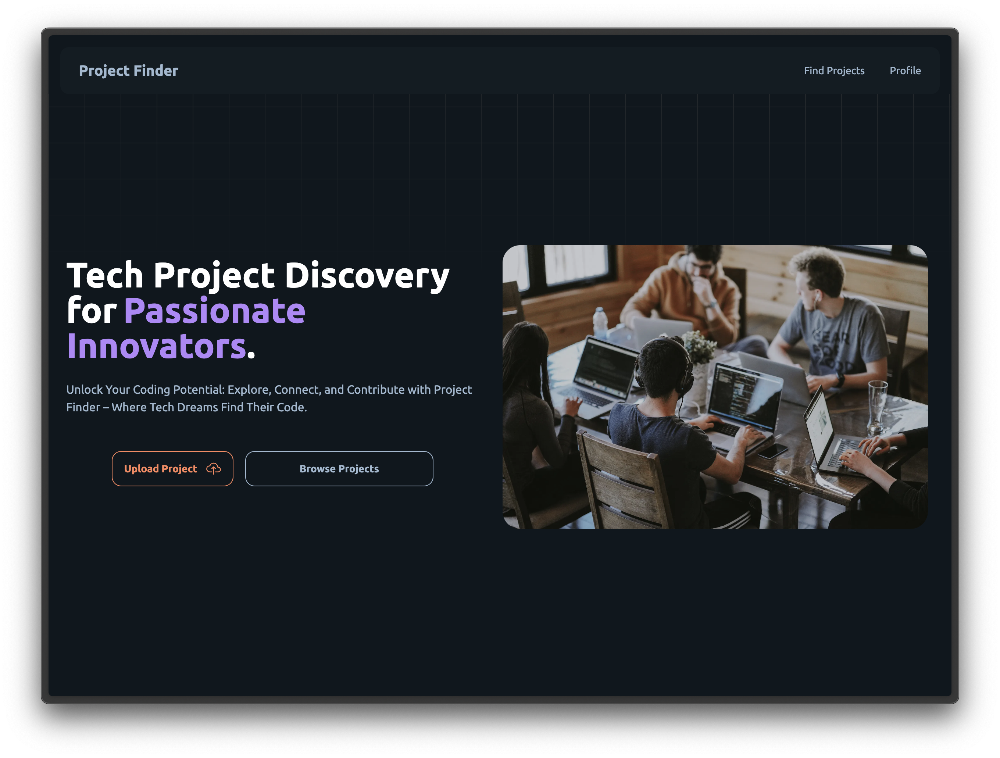

[](https://project-finderr.vercel.app/)

<h1 
align="center"
>
    Project Finder
</h1>

A Project Finder application is essential to address the growing demand for streamlined collaboration and project
discovery in various domains. With an increasing number of individuals and organizations seeking opportunities to
collaborate on diverse projects, there is a need for a centralized platform.

## How to run the project

1. Clone this repo

```bash
git clone https://github.com/ChiragAgg5k/project-finder.git
cd project-finder
```

2. Install dependencies using `npm` or `pnpm`

```bash
npm install
pnpm install # recommended
```

3. Create a `.env` file in the root directory and add the following environment variables

- `DATABASE_URL` - The URL of the database to connect to
- `NEXTAUTH_SECRET` - A secret string used to encrypt session data
- `NEXTAUTH_URL` - The URL of the application
- `GOOGLE_CLIENT_ID` - The client ID of the Google OAuth app
- `GOOGLE_CLIENT_SECRET` - The client secret of the Google OAuth app
- `UPLOADTHING_SECRET` - The secret key of the UploadThing API
- `UPLOADTHING_APP_ID` - The app ID of the UploadThing API
- `GITHUB_ACCESS_TOKEN` - The access token of the GitHub API

4. Run the development server

```bash
npm run dev # or
pnpm dev
```

5. Open [http://localhost:3000](http://localhost:3000) with your browser to see the result.

## Tech Stack

- [Next.js](https://nextjs.org/)
- [Tailwind CSS](https://tailwindcss.com/)
- [Drizzle ORM](https://drizzle-orm.github.io/)
- [UploadThing](https://uploadthingy.com/)
- [GitHub API](https://docs.github.com/en/rest)
- [Google OAuth](https://developers.google.com/identity/protocols/oauth2)
- [NextAuth.js](https://next-auth.js.org/)
- [Vercel](https://vercel.com/)
- [PlanetScale](https://planetscale.com/)

## About the project

This project was made for the Bennett University Industry Hackathon 2024. Following are the team members:

- Chirag Aggarwal - E22CSEU0325
- Ankit Raj - EE2CSEU0321
